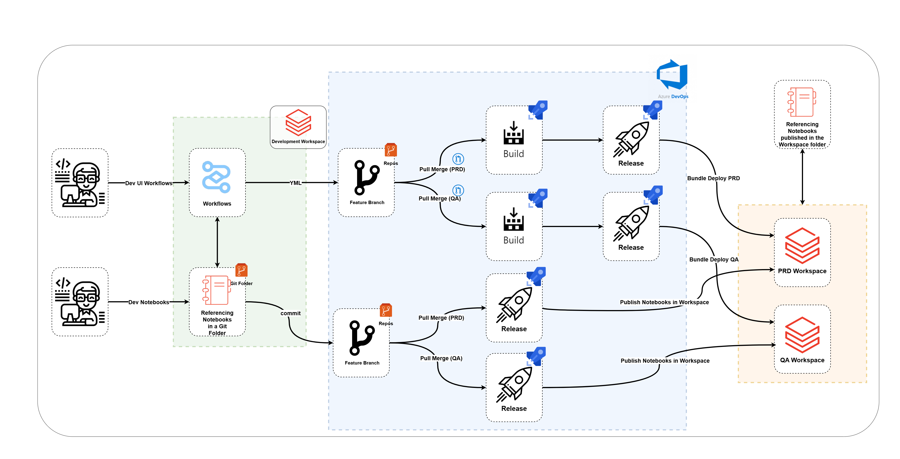
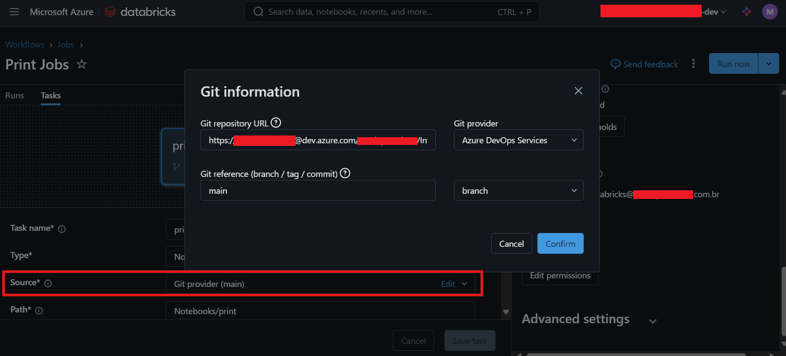
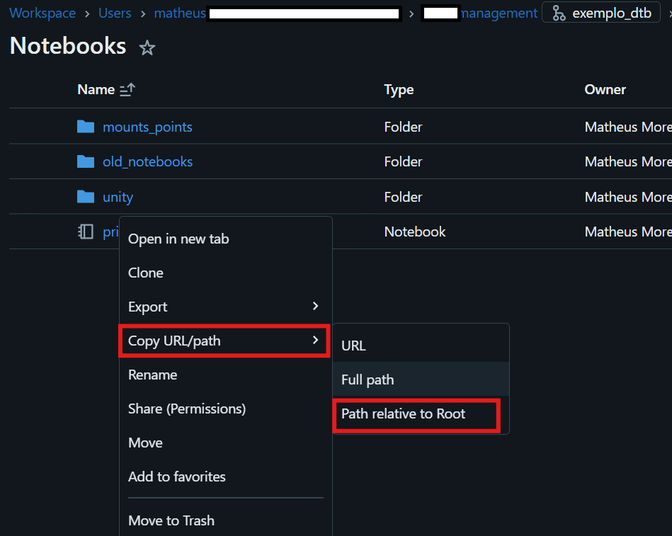

# Databricks Bundle Deployment

This repository contains the necessary files for configuring and deploying workflow jobs in Databricks. It is designed to centralize and automate the deployment of workflows via Azure DevOps pipelines, eliminating the need for manual or local deployment.

This template is based on an adaptation of the `default-python` template described in the [official Databricks documentation](https://docs.databricks.com/en/dev-tools/bundles/templates.html) and the [Databricks Bundles example repository](https://github.com/alfeuduran/databricks-bundles-example?tab=readme-ov-file).

## Architecture

The architecture consists of:  
1. **Initial Development:**  
   - Conducted in the Databricks workspace in the **dev** environment using the UI to create workflows.  
   - During this phase, the referenced notebook points to the Git repository.  

2. **Repointing During Deployment:**  
   - During the deployment process, the Git path of the notebook is repointed to the corresponding notebook in the Databricks workspace, located in the **workspace** folder.  
   - This repointing is automatically handled by the pipeline using the `replace_resources.py` script.  

With this approach, deployment is fully automated and standardized, ensuring consistency across development, QA, and production environments.

Full architecture:

## Repository Structure

The YAML files related to the workflows are located in the `/resource/*/*.yml` directory.  
They should be placed according to the defined project, ensuring better organization and maintenance of the structure.

- **`azure_pipelines/`**: Contains the Azure DevOps pipeline definitions.
  - `build_deploy_artifact.yml`: Pipeline for building and publishing the artifact.
  - `PIPELINE_SETUP.md`: Documentation on how the pipeline works.
- **`build_validate/`**: Scripts for validating workflows.
  - `VALIDATION_RULES.md`: Documentation on validation rules.
- **`bundle/`**: Source code for the Databricks Asset Bundle, including workflows and scripts.
  - `BUNDLE_STRUCTURE.md`: Documentation on the bundle structure.
  - `replace_resources.py`: Script to process resources (pipelines/workflows) for deployment.

## Starting Development

To start developing a workflow, follow the steps below:

1. **Access the Databricks Dev Workspace**  
   Navigate to the **Workflows** section and click **Create Job** to start developing the pipeline using the Databricks graphical interface.

2. **Define the Notebook Used**  
   Make sure to reference the DevOps repository when defining the notebook, using the `main` branch. This ensures that the notebook is already available in production.

3. **Get the Notebook Path in the Workflow (Dev)**  
   - Go to the Git folder where the notebook was developed.  
   - Right-click on the desired file.  
   - Select **Copy URL/Path** > **Path Relative to Root**.  
   - Paste this reference into the appropriate field in the workflow.  

4. **Set Parameters and Triggers**  
   Adjust the required parameters and triggers according to the workflow's functionality.

5. **Convert the Workflow to Code (YAML)**  
   After completing the workflow development:  
   - Click on the three dots in the upper-right corner.  
   - Select **Switch to Code Version (YAML)**.  
   - Copy the full code displayed on the screen.  

6. **Add the Workflow to the DevOps Repository**  
   - Create a new branch in the DevOps repository.  
   - In the `bundle/resources/` directory, locate the folder for the project related to the workflow.  
   - Create a new `.yml` file with the workflow name, e.g., `example_wkf.yml`.  
   - Paste the code copied from Databricks into the newly created file.  

7. **Commit and Open a Pull Request**  
   - Commit the changes to the new branch.  
   - Create a pull request (PR) for the desired branch:  
     - **`qa` branch**: Deploys the workflow to the QA environment.  
     - **`main` branch**: Deploys the workflow to production.  

8. **Deploy to QA**  
   - After merging the PR into the `qa` branch, the workflow will automatically be deployed to the QA environment.  
   - The default configured trigger will be:  
     - Name: `[dev deploy_devops_qa] <workflow name>`  
     - Note: The service principal responsible for deployment is `deploy_devops_qa`, which will also execute the workflow.  

## How Deployment Works in Azure DevOps

The deployment process in this project uses Azure DevOps to manage the steps and ensure that workflows are configured correctly in the desired environments. Below are the detailed steps:

1. **Replace Tokens**  
   - In Azure Pipelines, the *replace tokens* activity is executed on the `databricks.yml` file.  
   - This step replaces the `host` and `service_principal_name` keywords with values defined in an Azure DevOps library, based on the environment (QA or Production).  

2. **Python Environment Setup**  
   - The required Python version is defined, and the essential libraries are installed.  
   - This prepares the environment to run the `replace_resources.py` Python script.  

3. **Execution of the `replace_resources.py` Script**  
   - This script performs the following operations:  
     - Opens all `.yml` files located in the `resources` directory.  
     - Restructures the notebook path by removing the Git reference.  
     - Changes the path to directly point to the deployed notebooks in the Databricks workspace under the `workspace` directory.  
     - Sets the user responsible for executing the workflows in the respective environments.  

4. **Artifact Publication**  
   - After running the Python script, the generated artifact is published to the corresponding branch in the DevOps pipeline.  
   - Once this step is completed, the Azure DevOps *release* process is triggered.  

5. **Release Execution in Azure DevOps**  
   - During the *release* process, it connects to the **Azure Key Vault** to retrieve the necessary credentials.  
   - The `main.ps1` file in the repository is executed with the following steps:  
     - Logs into Azure using the *Service Principal*.  
     - Connects to the Databricks workspace.  
     - Validates the Databricks bundle using the `validate bundle` command.  
     - Deploys the bundle using the `deploy bundle` command.  
